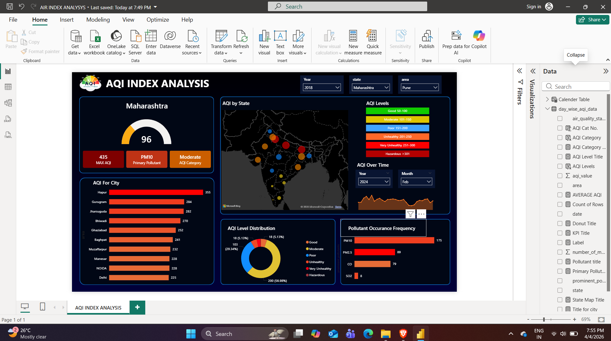

# 📊 AQI Power BI Dashboard

## 📌 Overview
This project analyzes Air Quality Index (AQI) data using Power BI.

## 🚀 Features
- AQI categorization (Good → Hazardous)
- Interactive dashboard with filters
- KPI cards and visual insights

## 🛠 Tools Used
- Power BI
- DAX
- Power Query

## 📷 Dashboard Preview

## 🎥 Project Demo Video
[Click here to watch demo](https://drive.google.com/file/d/1R_KiAWM09A6qDSor0cZYYLtJWdyJCOB0/view?usp=sharing)

## 📂 Files
- AQI_Dashboard.pbix
